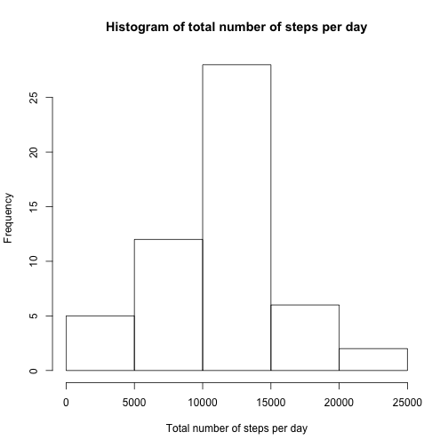
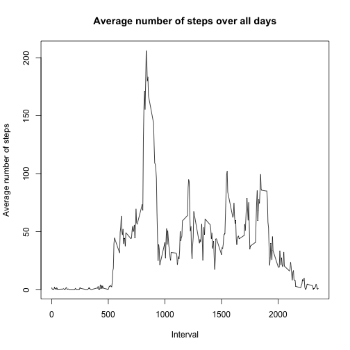
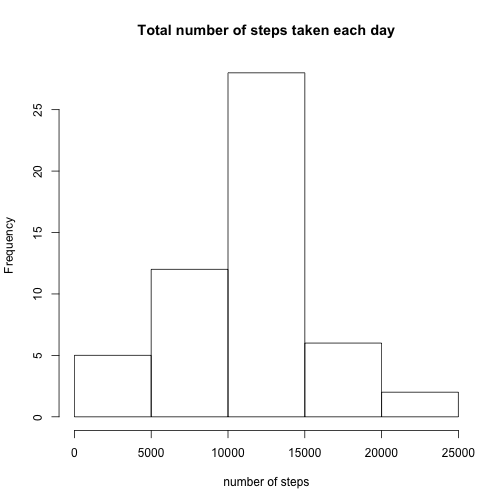
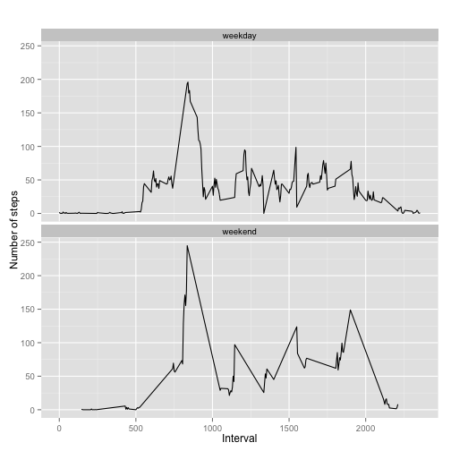

```r
# Load packages
library(knitr)
library(dplyr)
library(ggplot2)
```
### Loading and preprocessing the data
Show any code that is needed to

1: Load the data (i.e. read.csv())

2: Process/transform the data (if necessary) into a format suitable for your analysis


```r
# Load the data
activity_data <- read.csv(file="activity.csv", header=TRUE, sep=",")

# remove NAs
data <- activity_data[ with (activity_data, { !(is.na(steps)) } ), ]
data$date <- as.Date(data$date)
```

###What is mean total number of steps taken per day?

For this part of the assignment, you can ignore the missing values in the dataset.

1. Calculate the total number of steps taken per day


```r
per_day <- group_by(data,date)
steps_per_day <- summarise(per_day, total=sum(steps))
steps_per_day
```

```
## Source: local data frame [53 x 2]
## 
##          date total
## 1  2012-10-02   126
## 2  2012-10-03 11352
## 3  2012-10-04 12116
## 4  2012-10-05 13294
## 5  2012-10-06 15420
## 6  2012-10-07 11015
## 7  2012-10-09 12811
## 8  2012-10-10  9900
## 9  2012-10-11 10304
## 10 2012-10-12 17382
## ..        ...   ...
```

2. If you do not understand the difference between a histogram and a barplot, research the difference between them. Make a histogram of the total number of steps taken each day


```r
hist(steps_per_day$total, main="Histogram of total number of steps per day", xlab="Total number of steps per day")
```

 

3. Calculate and report the mean and median of the total number of steps taken per day


```r
summary(steps_per_day)
```

```
##       date                total      
##  Min.   :2012-10-02   Min.   :   41  
##  1st Qu.:2012-10-16   1st Qu.: 8841  
##  Median :2012-10-29   Median :10765  
##  Mean   :2012-10-30   Mean   :10766  
##  3rd Qu.:2012-11-16   3rd Qu.:13294  
##  Max.   :2012-11-29   Max.   :21194
```
**Summary of Total steps taken per day**

Mean: 10766

Median: 10765

###What is the average daily activity pattern?

1. Make a time series plot (i.e. type = "l") of the 5-minute interval (x-axis) and the average number of steps taken, averaged across all days (y-axis)


```r
# Prepare data
steps.interval <- aggregate(steps ~ interval, data=data, FUN=mean)

# Plot data
plot(steps.interval$interval, steps.interval$steps, type='l', 
     main="Average number of steps over all days", xlab="Interval", 
     ylab="Average number of steps")
```

 

2. Which 5-minute interval, on average across all the days in the dataset, contains the maximum number of steps?


```r
# Find row with maximum number of steps
max_steps <- which.max(steps.interval$steps)

# Find interval of maximum number of steps
steps.interval[max_steps, ]
```

```
##     interval    steps
## 104      835 206.1698
```
**Interval 835 has maximum number of steps.**

###Inputing missing values

Note that there are a number of days/intervals where there are missing values (coded as NA). The presence of missing days may introduce bias into some calculations or summaries of the data.

1. Calculate and report the total number of missing values in the dataset (i.e. the total number of rows with NAs)


```r
sum(is.na(activity_data))
```

```
## [1] 2304
```
**Total number of rows with NAs is 2304.**

2. Devise a strategy for filling in all of the missing values in the dataset. The strategy does not need to be sophisticated. For example, you could use the mean/median for that day, or the mean for that 5-minute interval, etc.


```r
# Calculate the mean per 5-minute interval
mean.interval <- aggregate(steps ~ interval, data=data, FUN=mean)
```

3. Create a new dataset that is equal to the original dataset but with the missing data filled in.


```r
# Merge original and mean per 5-minute interval dataset
data_merge <- merge(x=data, y=mean.interval, by="interval")

# Add column steps with missing data filled with the interval mean
data_merge$steps <- ifelse(is.na(data_merge$steps.x), data_merge$steps.y, data_merge$steps.x) 

# subselect only steps, date and interval columns
subset <- data_merge[c("steps", "date", "interval")]
```

4. Make a histogram of the total number of steps taken each day and Calculate and report the mean and median total number of steps taken per day. Do these values differ from the estimates from the first part of the assignment? What is the impact of imputing missing data on the estimates of the total daily number of steps?


```r
# aggregate by date and calculate sum
data_agg_day <- aggregate(steps ~ date, FUN=sum, data=subset)
vt_agg_day_na <- data_agg_day$steps
names(vt_agg_day_na) <- data_agg_day$date 

hist(data_agg_day$steps, xlab="number of steps", main="Total number of steps taken each day")
```

 


```r
# Calculate mean of imputed data
mean(data_agg_day$steps)
```

```
## [1] 10766.19
```


```r
# Calculate median of imputed data
median(data_agg_day$steps)
```

```
## [1] 10765
```

Yes, replacing the missing value with the average of the interval, the median is shifted closer to the mean.

###Are there differences in activity patterns between weekdays and weekends?

For this part the weekdays() function may be of some help here. Use the dataset with the filled-in missing values for this part.

1. Create a new factor variable in the dataset with two levels – “weekday” and “weekend” indicating whether a given date is a weekday or weekend day.


```r
# create new factor variable
subset$weekdays <- as.factor(ifelse(weekdays(data$date) %in% c("Saturday", "Sunday"), "weekend", "weekday"))
```

2. Make a panel plot containing a time series plot (i.e. type = "l") of the 5-minute interval (x-axis) and the average number of steps taken, averaged across all weekday days or weekend days (y-axis). See the README file in the GitHub repository to see an example of what this plot should look like using simulated data.


```r
# aggregate by weekday and apply mean
data_agg_weekdays <- aggregate(steps ~ interval + weekdays, FUN=mean, data=subset)

# make plot
qplot(interval, 
      steps, 
      data = data_agg_weekdays, 
      type = 'l', 
      geom=c("line"),
      xlab = "Interval", 
      ylab = "Number of steps", 
      main = "") +
  facet_wrap(~ weekdays, ncol = 1)
```

 
